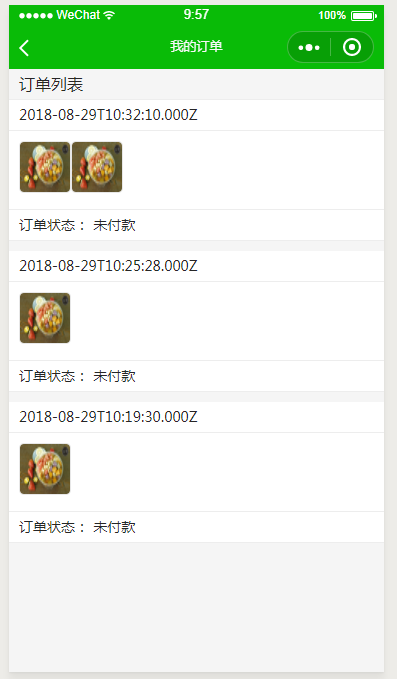
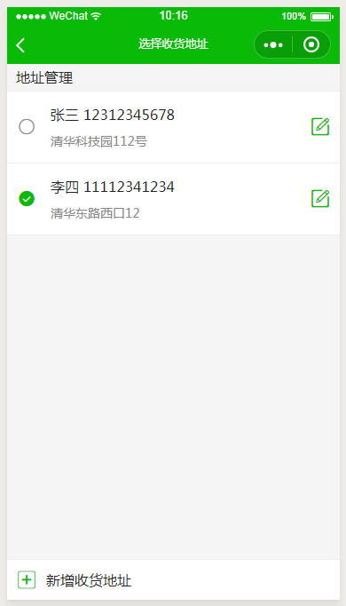

# 小程序Demo Node.js服务端与前端 WeShop - 小商店

## 功能
- 首页

- 分类

- 购物车

- 我的

- 提交订单

- 我的订单

- 收货地址管理

- 店铺地址

## server端
1. 准备建立Server 端服务，进入server目录中
2. 修改server目录下 config.js 中的相关配置（主要是appId，appSecret和mysql三项），
3. 执行npm install 安装依赖
4. 初始化数据库，进入server 目录中，执行tools下的initdb.js脚本，或者手动将weshop.sql文件导入数据库
5. 执行package.json 中相关的 npm 脚本命令，启动server服务

## client端
1. 修改client目录下congfig.js, 设置后台server服务启动地址和端口
2. 整个项目导入到微信小程序开发工具中，可运行和查看

